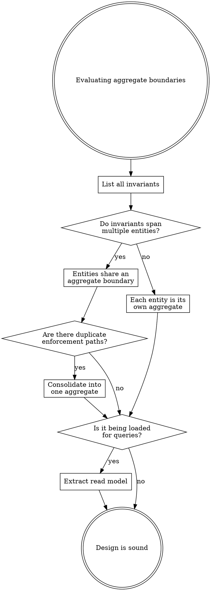

# CQRS Aggregate Design

**Aggregates are consistency boundaries, not data containers.** Their job is to enforce invariants within a single transaction. Queries, cross-aggregate views, and reporting belong in read models (Greg Young's CQRS).

## Decision Framework

**Steps:** (1) List every invariant. (2) Map each to participating entities. (3) Entities sharing invariants share an aggregate. (4) Check for duplicate enforcement. (5) Separate reads from writes. (6) For small collections (< 1000), correctness beats optimization.

## Vernon's Four Rules

| Rule | Meaning |
|------|---------|
| **Model true invariants** | Only group entities that MUST be consistent in a single transaction |
| **Design small aggregates** | ~70% are just root + value objects; 2-3 entities max otherwise |
| **Reference by identity** | Store IDs to other aggregates, not object references |
| **Eventual consistency outside** | Cross-aggregate coordination via domain events, not transactions |

**One transaction = one aggregate.** Need two aggregates in one operation? Either they're one aggregate (shared invariant) or use eventual consistency.

## Key Principles

**Aggregates enforce, read models answer.** Write side says "no" to invalid transitions. Read side answers questions. Never load an aggregate for a query. (Greg Young: "Does a screen have anything to do with managing your transactional invariants? Probably not.")

**Boundaries follow invariants, not data.** (Greg Young: "If you find yourself wanting aggregates to have relationships with other aggregates, you are modeling incorrectly. Organize in terms of behaviors, not data relationships.")

**Write-side repository is minimal:** `GetById` and `Save` only. Query methods on a write-side repository = mixed concerns.

## Anti-Patterns

| Pattern | Symptom | Fix |
|---------|---------|-----|
| **Dual Aggregate** | Two objects enforce the same invariant differently | Consolidate into the one with natural data access |
| **Fat Aggregate** | Loads thousands of entities for a few invariants | Challenge if invariant is real; consider eventual consistency |
| **Aggregate for Queries** | Instantiated in read-only operations (`list_all()`, `find_by_name()`) | Queries bypass aggregates; read directly from storage |
| **Anemic Aggregate** | Data bag with getters/setters, no business rules | Push rules in, or accept CRUD if genuinely no invariants |

## Event Sourcing Connection

Events are immutable past-tense facts. State is derived by replaying them. Read models subscribe to event streams and build queryable views. Multiple read models serve different query needs from the same events. Event sourcing is great for writes (append-only), impractical for queries -- hence CQRS.

## Sources

- Greg Young, "CQRS Documents" (cqrs.files.wordpress.com)
- Vaughn Vernon, "Effective Aggregate Design" Parts I-III (dddcommunity.org)
