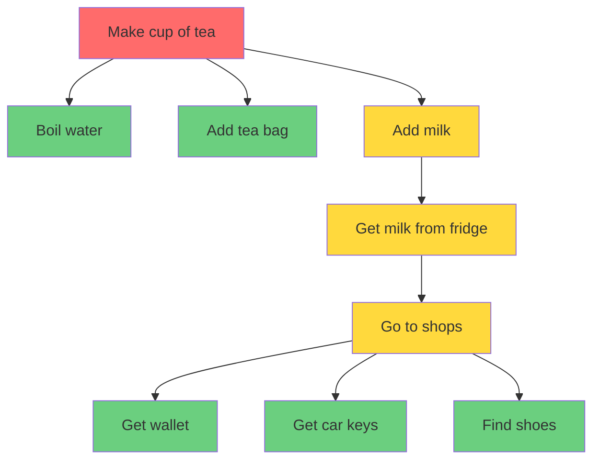

# Yaks - An iterative, emergent, non-linear TODO list for humans and robots

> It is in the doing of the work that we discover the work that we must do
> 
> -- Woody Zuill, https://agilemaxims.com

Yaks is CLI tool for managing Yak Maps - a TODO list of nested goals - designed for teams of humans and robots working on software projects together.

A Yak Map is basically the same as a [Mikado Graph](https://mikadomethod.info) or a [Discovery Tree](https://www.fastagile.io/method/product-mapping-and-discovery-trees). But I like calling it a Yak Map, because yak shaving is what we do all day in software.


Here's what I mean by a Yak Map:



## Isn't this just like Beads?

I've been using Yak Maps for several years working on teams of humans. We just used to cobble something together in Miro or whatever. [Beads](https://github.com/steveyegge/beads) was the first tool I've seen that supports this kind of acyclic graph for managing work, and I've found it hugely inspiring in this robot-driven era.

But beads has some shortcomings, for me:

* I like my software simple. I want my tools to do one thing well, and have minimal code and feeatures. Beads, for me, is over-featured and complicated.
* Yaks all the way down. There are no classifications of task here: epics, stories, tasks and whatnot. Everything is a yak.
* No more committing your plan to git. Yaks uses a hidden git ref to sync changes, so with `yx sync` anyone with a clone of the repo and a connection to `origin` can be working off the same list at the same time.

## Installation

### Quick Install (macOS/Linux)

```bash
curl -fsSL https://raw.githubusercontent.com/mattwynne/yaks/main/install.sh | bash
```

### Manual Install

1. Clone the repository
2. Add `bin/` to your PATH
3. Source the completion script in your shell config:
   ```bash
   source completions/yx.bash
   ```

### Automated/Non-Interactive Installation

For automated installations (CI, testing, scripts), use
environment variables to skip interactive prompts:

- `YX_SOURCE` - Path or URL to yx.zip (default: latest
  GitHub release)
- `YX_SHELL_CHOICE` - Shell for completions: `1` (zsh)
  or `2` (bash)
- `YX_AUTO_COMPLETE` - Auto-add to shell config: `y` or
  `n`

Example:

```bash
YX_SOURCE=./result/yx.zip \
  YX_SHELL_CHOICE=2 \
  YX_AUTO_COMPLETE=n \
  ./install.sh
```

### Development Setup

Uses direnv to automatically configure PATH and completions:

```bash
git clone https://github.com/mattwynne/yaks.git
cd yaks
direnv allow
dev setup  # Install git hooks
```

Before committing, always run:

```bash
dev check  # Runs tests and linting
```

Git hooks will prevent commits, merges, and pushes without recent verification.

## Usage

```bash
yx add Fix the bug          # Add a new yak
yx context Fix the bug      # Add context/notes
yx ls                       # Show all yaks
yx done Fix the bug         # Mark as complete
yx rm Fix the bug           # Remove a yak
yx prune                    # Remove all done yaks
```

Tab completion works for yak names after sourcing the completion script.

## Project Status

**Active development** - This tool is being used to build itself (dogfooding). See `.yaks/` for the actual work tracker.

## Testing

```bash
dev check               # Run all checks (tests + lint + audit)
cargo test --features test-support  # Cucumber + unit tests
shellspec               # ShellSpec tests (tmux, git, installer)
```

### Mutation Testing

```bash
dev mutate-diff         # Fast: only your changes (~seconds)
dev mutate              # Full run (~7 min)
dev mutate-sync         # Sync results to yak tracker
```

Mutation testing validates that your tests actually catch
regressions. Use `dev mutate-diff` during development for
fast feedback. Missed mutants are tracked as yaks under
"fix missed mutants" — run `dev mutate-sync` after a full
run to update them.

## License

[Add license here]
