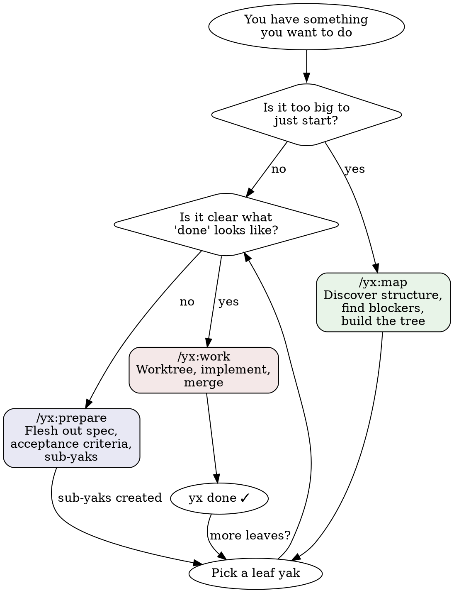
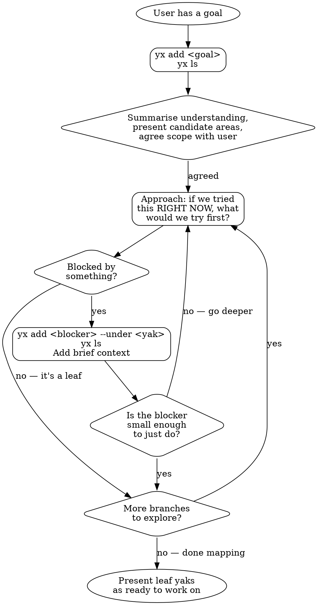

# Goal
Create a Claude Code plugin called `yx` so that Claude knows how to
use yaks effectively — mapping work, preparing yaks, and
implementing them.

# Type
Chore (no changes to yx itself — just creating plugin files)

# Success Criteria
- Plugin lives in the yaks repo: `plugins/yx/`
- Marketplace manifest at `.claude-plugin/marketplace.json`
- Three skills: `/yx:map`, `/yx:prepare`, `/yx:work`
- Skills drive `yx` CLI and `git` directly (no pi dependency)
- A new Claude Code user with `yx` installed can use the skills
  immediately after `/plugin marketplace add mattwynne/yaks`
  then `/plugin install yx@yaks`

# Design Decisions
- Plugin name: `yx` (skills invoked as `/yx:map` etc.)
- Three skills covering the yak lifecycle:
  - `map` — approach a goal, find blockers, build the yak tree
    (adapted from yak-mapping)
  - `prepare` — flesh out a yak with spec, acceptance criteria,
    and sub-yaks (adapted from preparing-a-yak, but without
    prescribing example mapping — encourage teams to establish
    their own acceptance criteria, ideally as automated tests)
  - `work` — pick up ready yaks, worktrees, implement, merge;
    covers both single and parallel (adapted from
    yak-worktree-workflow + parallel-yak-implementation)
- No dependency on pi — pure Claude Code + yx CLI + git
- The yaks repo is the marketplace (users point at mattwynne/yaks)

# Flow diagrams
Create `plugins/yx/docs/` with two Graphviz diagrams that skills
can reference. These help Claude (and humans) understand when to
use each skill and how mapping works.

## Overview flow: when to use which skill

## Mapping flow: how /yx:map works

