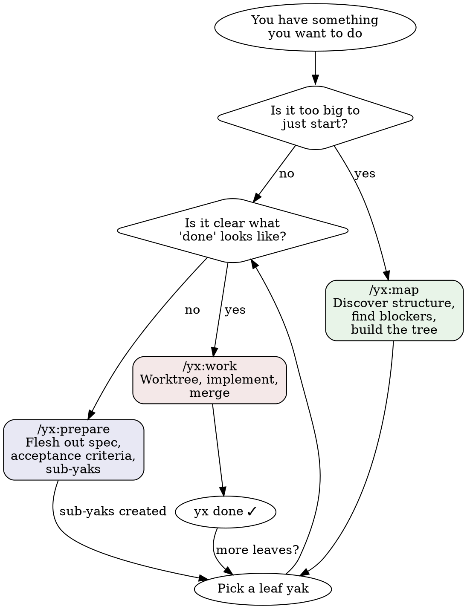
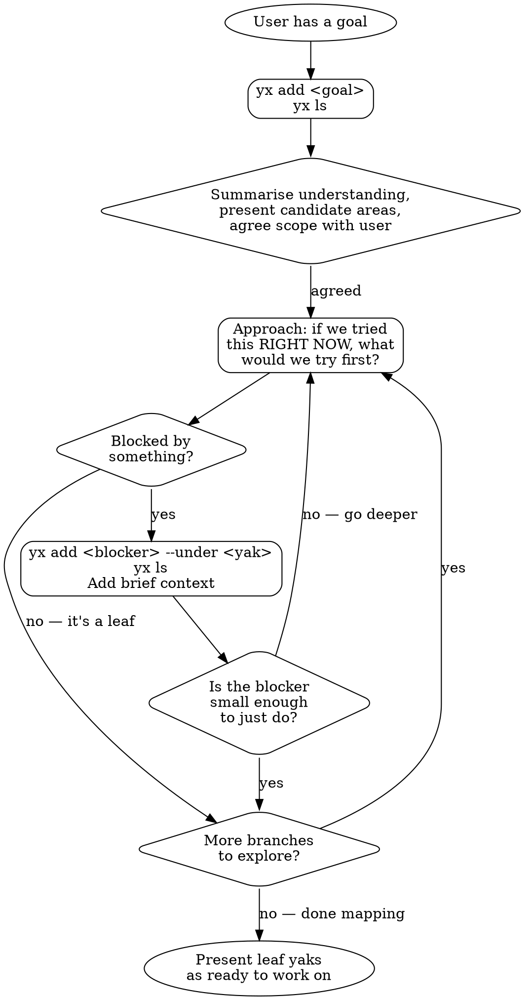

# Goal
Create a Claude Code plugin called `yx` so that Claude knows how to
use yaks effectively — mapping work, preparing yaks, and
implementing them.

# Type
Chore (no changes to yx itself — just creating plugin files)

# Success Criteria
- Plugin lives in the yaks repo: `plugins/yx/`
- Marketplace manifest at `.claude-plugin/marketplace.json`
- Three skills: `/yx:map`, `/yx:prepare`, `/yx:work`
- Skills drive `yx` CLI and `git` directly (no pi dependency)
- A new Claude Code user with `yx` installed can use the skills
  immediately after `/plugin marketplace add mattwynne/yaks`
  then `/plugin install yx@yaks`

# Design Decisions
- Plugin name: `yx` (skills invoked as `/yx:map` etc.)
- Three skills covering the yak lifecycle:
  - `map` — approach a goal, find blockers, build the yak tree
    (adapted from yak-mapping)
  - `prepare` — flesh out a yak with spec, acceptance criteria,
    and sub-yaks (adapted from preparing-a-yak, but without
    prescribing example mapping — encourage teams to establish
    their own acceptance criteria, ideally as automated tests)
  - `work` — pick up ready yaks, worktrees, implement, merge;
    covers both single and parallel (adapted from
    yak-worktree-workflow + parallel-yak-implementation)
- No dependency on pi — pure Claude Code + yx CLI + git
- The yaks repo is the marketplace (users point at mattwynne/yaks)

# Convention: @needs-human tag
All three skills should teach Claude to use this pattern when stuck:

**Setting the tag (when Claude is stuck):**
1. Tag the yak: `yx tag "yak name" @needs-human`
2. Add the question to the yak's context (what you need, why,
   what options you see)
3. Move on to another leaf if one is available

**Encountering the tag (when picking up a yak):**
Don't silently skip it. Surface the question to the human:
"This yak is tagged @needs-human. Here's the open question:
[question from context]. Want to answer it now, or should I
pick a different yak?"

The tag is a conversation starter, not a wall.

# Design principle: delegate to subagents to save context
Context is the most precious resource. Always look for
opportunities to delegate work to subagents so the main
conversation stays clean for decision-making.

Concrete opportunities in each skill:

- `/yx:map` — mostly conversational, limited delegation.
  Could delegate codebase exploration when deciding scope.
- `/yx:prepare` — delegate codebase exploration to a subagent
  ("read the relevant files and summarise what exists") before
  the brainstorming conversation. Keeps main context for the
  spec discussion with the human.
- `/yx:work` — the big one. Always delegate implementation to
  a subagent per worktree. The main agent orchestrates: picks
  yaks, creates worktrees, reviews results, merges. Subagents
  do the coding. This applies to both single and parallel yaks.
  For parallel, dispatch multiple subagents simultaneously.

# Skill authoring guidelines (from Claude Code docs)
- Keep SKILL.md under 500 lines — use supporting files for
  reference material
- Good `description` in frontmatter helps Claude auto-load
- Skills accept `$ARGUMENTS` (e.g. `/yx:work fix the build`)
- Consider `allowed-tools` for safety
- Flow diagrams can be supporting files referenced from SKILL.md

# Flow diagrams
Create `plugins/yx/docs/` with two Graphviz diagrams that skills
can reference. These help Claude (and humans) understand when to
use each skill and how mapping works.

## Overview flow: when to use which skill

## Mapping flow: how /yx:map works

